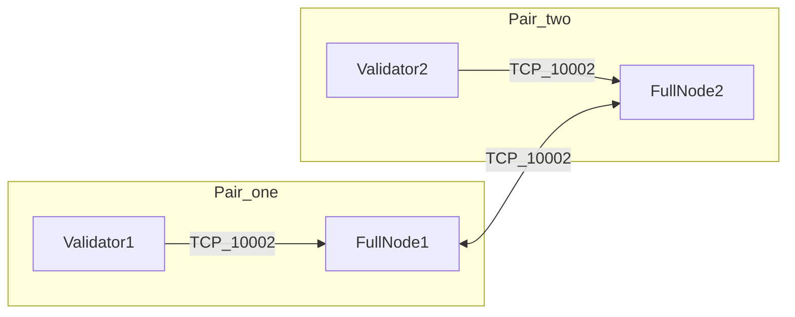

# AWS IBFT topology (2 validators + 2 full nodes)

This document matches the deployment shape planned for Polygon Edge **IBFT** on EC2 and the security-group layout in **`ucl-devops`** (`tf_main_cloudops_consortium/.../security_groups`).

## Logical layout

- **Allowed on TCP 10002**: full node ↔ full node (both directions); validator ↔ its full node (both directions).
- **Not allowed**: validator ↔ validator on 10002 (no matching security group rule).

Other access (SSH via EC2 Instance Connect, JSON-RPC via NLB/ALB, etc.) is defined separately in Terraform.

## Process model

- One binary: `polygon-edge server` on every host ([`command/server`](../command/server/server.go)).
- **Validator** vs **full node** is **not** a different build. For IBFT, a node runs consensus only if its **local signer address** is in the genesis validator set ([`consensus/ibft/ibft.go`](../consensus/ibft/ibft.go) — `isActiveValidator()`). Full nodes use their own `secrets init` data dirs whose **validator key is not** in that set.

## Libp2p port

Use **`--libp2p 0.0.0.0:10002`** (or `:10002`) on any instance that participates in the mesh so it matches the security groups.

## Genesis bootnodes vs validator keys

- **`--validators` / IBFT extra data** carry **ECDSA address + BLS public key** (for BLS validator type). Format produced by [`scripts/aws-ibft`](../scripts/aws-ibft/) is `address:blsPublicKey` as required by [`validators.ParseBLSValidator`](../validators/helper.go).
- **`bootnodes`** in `genesis.json` should list **reachable** multiaddrs for discovery — typically the **two full nodes** at `/dns4/<host>/tcp/10002/p2p/<FullNodePeerID>` (or `/ip4/...`). Use each full node’s **Node ID** from `secrets output` for that full node’s data directory.

Validators still run their **own** libp2p stack; with your SG rules they usually **peer only** toward their full node and rely on full nodes to extend the gossip mesh. **Validate on a staging network** that blocks validator–validator traffic before production.

## Peer ID in multiaddrs (design choice)

The `/p2p/<PeerID>` in a bootnode multiaddr must match the **libp2p identity** of the process you expect peers to dial (here, the **full node**). Keep validator and full-node peering consistent with how you run `server` on each host.

## Automation in this repo

- [`scripts/aws-ibft/README.md`](../scripts/aws-ibft/README.md) — local coordinator workflow: init secrets, build `genesis.json`, pack host bundles.
- Optional systemd unit: `scripts/aws-ibft/polygon-edge.service`.

## Validation checklist

1. Full nodes see each other as peers (logs / admin API).
2. With both validators up, blocks progress.
3. With one validator stopped, expect stall with **2 validators** (fault tolerance 0).
4. With SGs enforcing **no** validator–validator 10002, confirm consensus still finalizes (staged test).
