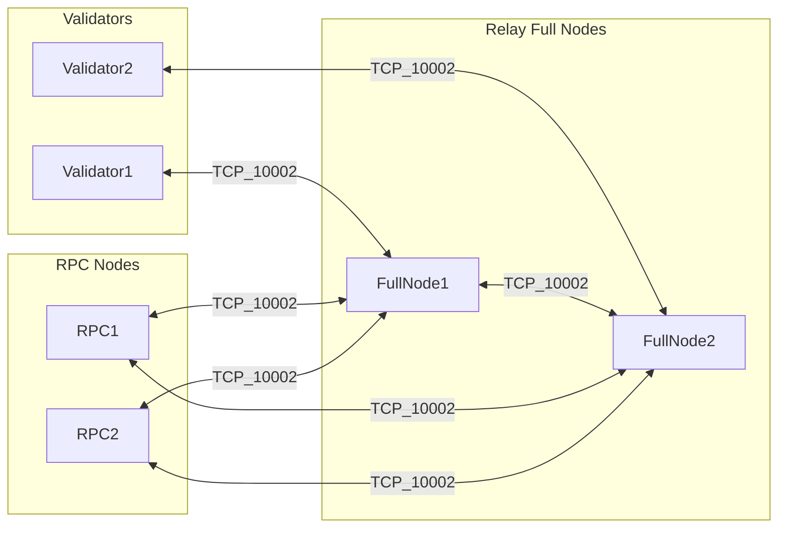

# AWS IBFT topology (example: 2 validators + 2 full nodes + 2 RPC nodes)

This document matches the deployment shape planned for Polygon Edge **IBFT** on EC2 and the security-group layout in **`ucl-devops`** (`tf_main_cloudops_consortium/.../security_groups`).
The scripts under [`scripts/aws-ibft/`](../scripts/aws-ibft/) support arbitrary `validator-*`, `fullnode-*`, and `rpc-*` counts; this doc shows one concrete **2 + 2 + 2** security-group example.

## Logical layout

- **Allowed on TCP 10002**: full node ↔ full node; validator ↔ full node; RPC node ↔ full node.
- **Not allowed**: validator ↔ validator; RPC node ↔ validator. RPC node ↔ RPC node is optional and usually unnecessary.

Other access (SSH via EC2 Instance Connect, JSON-RPC via NLB/ALB, etc.) is defined separately in Terraform.

## Process model

- One binary: `polygon-edge server` on every host ([`command/server`](../command/server/server.go)).
- **Validator** vs **full node / RPC node** is **not** a different build. For IBFT, a node runs consensus only if its **local signer address** is in the genesis validator set ([`consensus/ibft/ibft.go`](../consensus/ibft/ibft.go) — `isActiveValidator()`). Full nodes and RPC nodes use their own `secrets init` data dirs whose **validator key is not** in that set.

## Libp2p port

Use **`--libp2p 0.0.0.0:10002`** (or `:10002`) on any instance that participates in the mesh so it matches the security groups.

## Genesis bootnodes vs validator keys

- **`--validators` / IBFT extra data** carry **ECDSA address + BLS public key** (for BLS validator type). Format produced by [`scripts/aws-ibft`](../scripts/aws-ibft/) is `address:blsPublicKey` as required by [`validators.ParseBLSValidator`](../validators/helper.go).
- **`bootnodes`** in `genesis.json` should list **reachable** multiaddrs for discovery — typically the **two full nodes** at `/dns4/<host>/tcp/10002/p2p/<FullNodePeerID>` (or `/ip4/...`). Use each full node’s **Node ID** from `secrets output` for that full node’s data directory. Keep bootnodes on the relay full-node layer; do not point them at validators or RPC nodes.

Validators still run their **own** libp2p stack; with your SG rules they peer toward the relay full-node layer and rely on the full nodes to extend the gossip mesh. RPC nodes do the same, but have no direct validator access at the infrastructure layer. **Validate on a staging network** with the intended SG restrictions before production.

## Peer ID in multiaddrs (design choice)

The `/p2p/<PeerID>` in a bootnode multiaddr must match the **libp2p identity** of the process you expect peers to dial (here, the **full node**). Keep validator and full-node peering consistent with how you run `server` on each host.

## Automation in this repo

- [`scripts/aws-ibft/README.md`](../scripts/aws-ibft/README.md) — local coordinator workflow: init secrets, build `genesis.json`, pack host bundles.
- Optional systemd unit: `scripts/aws-ibft/polygon-edge.service`.

## Validation checklist

1. Full nodes see each other as peers (logs / admin API).
2. With both validators up, blocks progress.
3. RPC nodes peer with one or both full nodes, and do not require direct validator reachability.
4. With one validator stopped, expect stall with **2 validators** (fault tolerance 0).
5. With SGs enforcing **no** validator–validator and **no** RPC–validator 10002, confirm consensus still finalizes and RPC nodes stay connected through the full-node layer.
